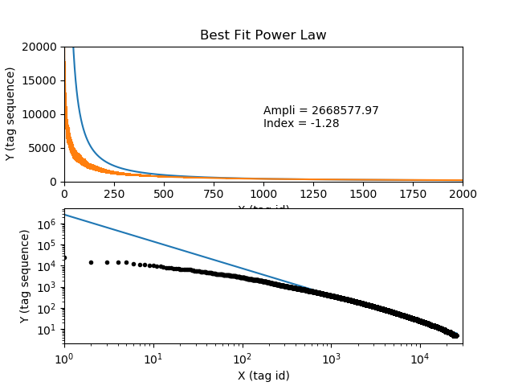
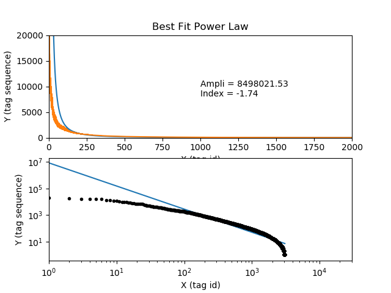

### tag的frequency分析

知乎 25552个tag




Askubuntu 3062个tag



### tag的support和confidence分析

以下数据选自askubuntu的10586个posts, 使用aprior算法筛选support>= 0.006的组合，并将confidence>=0.3的组合筛选出来。

```
data_set: 10586 posts

support >= 0.006
conf >= 0.3

(['mouse-scroll']) --> (['mouse']) conf: 1.0
(['quickly']) --> (['application-development']) conf: 1.0
(['netplan']) --> (['networking']) conf: 0.888888888889
(['adapter']) --> (['wireless']) conf: 0.888888888889
(['network-bridge']) --> (['networking']) conf: 0.888888888889
(['winetricks']) --> (['wine']) conf: 0.875
(['jdk']) --> (['java']) conf: 0.866666666667
(['atheros']) --> (['wireless']) conf: 0.866666666667
(['text-processing']) --> (['command-line']) conf: 0.853658536585
(['openjdk']) --> (['java']) conf: 0.846153846154
(['headphones']) --> (['sound']) conf: 0.823529411765
(['cuda']) --> (['nvidia']) conf: 0.791666666667
(['plasma-5']) --> (['kubuntu']) conf: 0.777777777778
(['plasma-5']) --> (['kde']) conf: 0.777777777778
(['ecryptfs']) --> (['encryption']) conf: 0.777777777778
(['bashrc']) --> (['bash']) conf: 0.75
(['boot-repair']) --> (['grub2']) conf: 0.736842105263
(['alsa']) --> (['sound']) conf: 0.733333333333
(['vsftpd']) --> (['ftp']) conf: 0.727272727273
(['deja-dup']) --> (['backup']) conf: 0.714285714286
(['inspiron']) --> (['dell']) conf: 0.7
(['broadcom']) --> (['wireless']) conf: 0.698412698413
(['synaptics']) --> (['touchpad']) conf: 0.6875
(['gparted']) --> (['partitioning']) conf: 0.686274509804
(['sed']) --> (['command-line']) conf: 0.681818181818
(['canon']) --> (['printing']) conf: 0.68
(['postfix']) --> (['email']) conf: 0.666666666667
(['aptitude']) --> (['apt']) conf: 0.666666666667
(['nvidia-optimus']) --> (['nvidia']) conf: 0.666666666667
(['pulseaudio']) --> (['sound']) conf: 0.654545454545
(['ethernet']) --> (['networking']) conf: 0.648148148148
(['cifs']) --> (['samba']) conf: 0.642857142857
(['pip']) --> (['python']) conf: 0.642857142857
(['plymouth']) --> (['boot']) conf: 0.636363636364
(['soundcard']) --> (['sound']) conf: 0.636363636364
(['intel-wireless']) --> (['wireless']) conf: 0.631578947368
(['windows-10']) --> (['dual-boot']) conf: 0.622222222222
(['dhcp']) --> (['networking']) conf: 0.620689655172
(['awk']) --> (['command-line']) conf: 0.615384615385
(['xps']) --> (['dell']) conf: 0.615384615385
(['microphone']) --> (['sound']) conf: 0.6
(['alsa']) --> (['pulseaudio']) conf: 0.6
(['realtek']) --> (['drivers']) conf: 0.588235294118
(['lxde']) --> (['lubuntu']) conf: 0.578947368421
(['dpkg']) --> (['apt']) conf: 0.575
(['bumblebee']) --> (['nvidia']) conf: 0.571428571429
(['cifs']) --> (['mount']) conf: 0.571428571429
(['automount']) --> (['mount']) conf: 0.565217391304
(['maas']) --> (['juju']) conf: 0.560975609756
(['fstab']) --> (['mount']) conf: 0.558823529412
(['unity-dash']) --> (['unity']) conf: 0.552631578947
(['launcher']) --> (['unity']) conf: 0.55
(['playonlinux']) --> (['wine']) conf: 0.545454545455
(['windows-8']) --> (['dual-boot']) conf: 0.539682539683
(['uefi']) --> (['boot']) conf: 0.5390625
(['minecraft']) --> (['java']) conf: 0.538461538462
(['grub2', 'partitioning', 'uefi']) --> (['dual-boot', 'boot']) conf: 0.533333333333
(['dns']) --> (['networking']) conf: 0.529411764706
(['grep']) --> (['command-line']) conf: 0.529411764706
(['32-bit']) --> (['64-bit']) conf: 0.526315789474
(['uefi']) --> (['dual-boot']) conf: 0.5234375
(['openstack']) --> (['juju']) conf: 0.51724137931
(['find']) --> (['command-line']) conf: 0.5
(['fglrx']) --> (['ati']) conf: 0.5
(['ubuntu-sdk']) --> (['application-development']) conf: 0.5
(['repository']) --> (['apt']) conf: 0.5
(['gpu']) --> (['nvidia']) conf: 0.5
(['partitioning', 'boot', 'uefi']) --> (['grub2', 'dual-boot']) conf: 0.5
(['uefi']) --> (['grub2']) conf: 0.4921875
(['pulseaudio']) --> (['alsa']) conf: 0.490909090909
(['bootloader']) --> (['grub2']) conf: 0.481481481481
(['bootloader']) --> (['dual-boot']) conf: 0.481481481481
(['partitioning', 'uefi']) --> (['grub2', 'dual-boot']) conf: 0.48
(['kde']) --> (['kubuntu']) conf: 0.479452054795
(['keyboard-layout']) --> (['keyboard']) conf: 0.479452054795
(['juju']) --> (['maas']) conf: 0.479166666667
(['lts']) --> (['16.04']) conf: 0.478260869565
(['grub2']) --> (['boot']) conf: 0.476454293629
(['sync']) --> (['ubuntu-one']) conf: 0.47619047619
(['bash']) --> (['command-line']) conf: 0.474103585657
(['network-manager']) --> (['networking']) conf: 0.471153846154
(['partitioning', 'uefi', 'dual-boot']) --> (['grub2', 'boot']) conf: 0.470588235294
(['ssl']) --> (['apache2']) conf: 0.466666666667
(['luks']) --> (['encryption']) conf: 0.466666666667
(['alsa']) --> (['sound', 'pulseaudio']) conf: 0.466666666667
(['internet']) --> (['networking']) conf: 0.464646464646
(['graphics']) --> (['drivers']) conf: 0.464285714286
(['scripts']) --> (['bash']) conf: 0.458333333333
(['grub2', 'partitioning']) --> (['dual-boot', 'boot']) conf: 0.456140350877
(['fglrx']) --> (['drivers']) conf: 0.454545454545
(['openstack']) --> (['maas']) conf: 0.448275862069
(['grubrescue']) --> (['grub2']) conf: 0.444444444444
(['grub2']) --> (['dual-boot']) conf: 0.443213296399
(['scripts']) --> (['command-line']) conf: 0.440476190476
(['partitioning', 'uefi']) --> (['grub2', 'boot']) conf: 0.44
(['intel-graphics']) --> (['drivers']) conf: 0.431034482759
(['resolution']) --> (['nvidia']) conf: 0.424242424242
(['ppa']) --> (['apt']) conf: 0.421052631579
(['cuda']) --> (['drivers']) conf: 0.416666666667
(['cuda']) --> (['drivers', 'nvidia']) conf: 0.416666666667
(['vpn']) --> (['networking']) conf: 0.415094339623
(['display-resolution']) --> (['display']) conf: 0.413043478261
(['dpkg']) --> (['package-management']) conf: 0.4125
(['realtek']) --> (['wireless']) conf: 0.411764705882
(['kvm']) --> (['virtualization']) conf: 0.409090909091
(['compiz']) --> (['unity']) conf: 0.405797101449
(['ati']) --> (['drivers']) conf: 0.404761904762
(['canon']) --> (['drivers']) conf: 0.4
(['grub2', 'uefi']) --> (['dual-boot', 'boot']) conf: 0.396825396825
(['php']) --> (['apache2']) conf: 0.396551724138
(['xfce']) --> (['xubuntu']) conf: 0.395348837209
(['internet']) --> (['wireless']) conf: 0.393939393939
(['package-management']) --> (['apt']) conf: 0.392070484581
(['windows-7']) --> (['dual-boot']) conf: 0.388888888889
(['environment-variables']) --> (['bash']) conf: 0.388888888889
(['radeon']) --> (['drivers']) conf: 0.387755102041
(['radeon']) --> (['ati']) conf: 0.387755102041
(['dependencies']) --> (['package-management']) conf: 0.384615384615
(['pulseaudio']) --> (['sound', 'alsa']) conf: 0.381818181818
(['ftp']) --> (['vsftpd']) conf: 0.380952380952
(['workspaces']) --> (['unity']) conf: 0.379310344828
(['virtualization']) --> (['virtualbox']) conf: 0.377049180328
(['bashrc']) --> (['command-line']) conf: 0.375
(['amd-graphics']) --> (['drivers']) conf: 0.375
(['openvpn']) --> (['vpn']) conf: 0.375
(['dual-boot', 'uefi']) --> (['grub2', 'boot']) conf: 0.373134328358
(['update-manager']) --> (['updates']) conf: 0.372549019608
(['graphics']) --> (['nvidia']) conf: 0.371428571429
(['intel-wireless']) --> (['networking']) conf: 0.368421052632
(['dual-boot']) --> (['grub2']) conf: 0.366132723112
(['broadcom']) --> (['drivers']) conf: 0.365079365079
(['lvm']) --> (['partitioning']) conf: 0.363636363636
(['boot', 'uefi']) --> (['grub2', 'dual-boot']) conf: 0.36231884058
(['dual-boot']) --> (['boot']) conf: 0.361556064073
(['lamp']) --> (['apache2']) conf: 0.36
(['partitioning', 'uefi']) --> (['dual-boot', 'boot']) conf: 0.36
(['email']) --> (['postfix']) conf: 0.355555555556
(['shortcut-keys']) --> (['keyboard']) conf: 0.354166666667
(['gnome-shell']) --> (['18.04']) conf: 0.352941176471
(['gtk']) --> (['themes']) conf: 0.351351351351
(['amd-graphics']) --> (['graphics']) conf: 0.35
(['opengl']) --> (['graphics']) conf: 0.35
(['scanner']) --> (['drivers']) conf: 0.35
(['updates']) --> (['apt']) conf: 0.349112426036
(['openvpn']) --> (['networking']) conf: 0.34375
(['battery']) --> (['power-management']) conf: 0.341463414634
(['dependencies']) --> (['apt']) conf: 0.338461538462
(['postfix']) --> (['server']) conf: 0.333333333333
(['ftp']) --> (['server']) conf: 0.333333333333
(['panel']) --> (['unity']) conf: 0.333333333333
(['grubrescue']) --> (['dual-boot']) conf: 0.333333333333
(['grubrescue']) --> (['boot']) conf: 0.333333333333
(['bootloader']) --> (['boot']) conf: 0.333333333333
(['partitioning']) --> (['dual-boot']) conf: 0.331325301205
(['nvidia']) --> (['drivers']) conf: 0.329411764706
(['intel-graphics']) --> (['graphics']) conf: 0.327586206897
(['ssd']) --> (['partitioning']) conf: 0.326530612245
(['bios']) --> (['dual-boot']) conf: 0.322580645161
(['display']) --> (['multiple-monitors']) conf: 0.32183908046
(['uefi']) --> (['grub2', 'dual-boot']) conf: 0.3203125
(['games']) --> (['wine']) conf: 0.32
(['partitioning', 'uefi']) --> (['grub2', 'dual-boot', 'boot']) conf: 0.32
(['wireless']) --> (['networking']) conf: 0.319672131148
(['playonlinux']) --> (['games']) conf: 0.318181818182
(['sed']) --> (['bash']) conf: 0.318181818182
(['wallpaper']) --> (['gnome']) conf: 0.318181818182
(['sed']) --> (['bash', 'command-line']) conf: 0.318181818182
(['maas']) --> (['openstack']) conf: 0.317073170732
(['juju']) --> (['openstack']) conf: 0.3125
(['partitioning', 'boot']) --> (['grub2', 'dual-boot']) conf: 0.309523809524
(['icons']) --> (['unity']) conf: 0.308823529412
(['bash']) --> (['scripts']) conf: 0.306772908367
(['uefi']) --> (['grub2', 'boot']) conf: 0.3046875
(['display-resolution']) --> (['nvidia']) conf: 0.304347826087
(['indicator']) --> (['unity']) conf: 0.304347826087
(['development']) --> (['application-development']) conf: 0.304347826087
(['gnome-terminal']) --> (['command-line']) conf: 0.301886792453
(['broadcom']) --> (['networking']) conf: 0.301587301587
```

